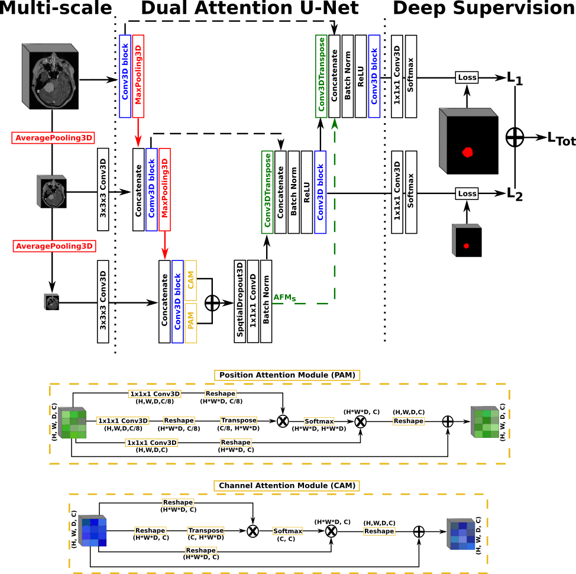

# Meningioma segmentation in T1-weighted MRI leveraging global context and attention mechanisms
- - -

## 1. Description
The repository contains the architectures, inference code,
and trained models for meningioma segmentation in T1-weighted MRI volumes.

Please cite the following article if you re-use any part:
>`@misc{bouget2021meningioma,`  
      `title={Meningioma segmentation in T1-weighted MRI leveraging global context and attention mechanisms},`   
      `author={David Bouget and André Pedersen and Sayied Abdol Mohieb Hosainey and Ole Solheim and Ingerid Reinertsen},`  
      `year={2021},`  
      `eprint={2101.07715},`  
      `archivePrefix={arXiv},`  
      `primaryClass={eess.IV}`  
`}`

## 2. Installation
The following steps have been tested on both Ubuntu and Windows. The details below are for Linux. See the troubleshooting section below for Windows-specific details. 
### a. Python
The Python virtual environment can be setup using the following commands:  

> `virtualenv -p python3 venv`  
`source venv/bin/activate`  
`pip install -r requirements.txt`

### b. Docker  
Simply download the corresponding Docker image:  

> `docker pull dbouget/mri_brain-tumor_segmentation:v1`

### c. Models
In order to download the models locally and prepare the folders, simply run the following:   

> `source venv/bin/activate`  
`python setup.py`  
`deactivate`

## 3. Use
The command line input parameters are the following:
- i [Input]: Path to the MRI volume file, preferably in nifti format. Other formats will
  be converted to nifti before being processed, using SimpleITK.  
- o [Output]: Path and prefix for the predictions file. The base name must already exist
  on disk.
- m [Model]: Name of the model to use for inference, in the list [UNet-Slabs, PLS-Net, UNet-FV, AGUNet, DAGUNet] 
- g [GPU]: Id of the GPU to use for inference. The CPU is used if no eligible number is provided.

A runtime configuration file also exists in resources/data/runtime_config.ini,
where additional variables can be modified:  
- non_overlapping: [true, false], only in effect for the UNet-Slabs model. 
  True indicates no overlapping in predictions while false indicates stride 1 overlap.
- reconstruction_method: [thresholding, probabilities]. In the latter, raw prediction maps
  in range [0, 1] are dumped while in the former a binary mask is dumped using a pre-set
  probability threshold value.
- reconstruction_order: [resample_first, resample_second]. In the former, the raw probability map
  is resampled to the original patient's space before the reconstruction happens (slower) while
  in the former the opposite is performed (faster).  
- probability_threshold: threshold value to be used when the reconstruction method is set to thresholding
  (optimal values for each model can be found in the paper).
  
### a. Python
To run inference with the attention-gated U-Net model, using GPU 0, execute the following in the project root directory:  
> `source venv/bin/activate`  
`python main.py -i /path/to/file.nii.gz -o /output/path/to/output_prefix -m AGUNet -g 0`  
`deactivate`

### b. Docker
The local resources sub-folder is mapped to the resources sub-folder within the docker container.
As such, input MRI volumes have to be copied inside resources/data to be processed and the output folder
for the predictions has to be set within the resources sub-folder to be accessible locally.  
:warning: The docker container does not have gpu support so all inferences are performed on CPU only.   

> `cp /path/to/mri.nii.gz /path/to/mri_brain_tumor_segmentation/resources/data/mri-nii.gz`    
`docker run --entrypoint /bin/bash -v /path/to/mri_brain_tumor_segmentation/resources:/home/ubuntu/resources -t -i dbouget/mri_brain-tumor_segmentation:v1`  
`cd /home/ubuntu/mri_brain_tumor_segmentation`  
`python main.py -i resources/data/mri.nii.gz -o resources/output_prefix -m AGUNet`  

## 4. Acknowledgements
Parts of the models' architectures were collected from the following repositories:  
- https://github.com/niecongchong/DANet-keras/  
- https://github.com/ozan-oktay/Attention-Gated-Networks  

For more detailed information about attention mechanisms, please read the corresponding publications:

>`@inproceedings{fu2019dual,`  
  `title={Dual attention network for scene segmentation},`  
  `author={Fu, Jun and Liu, Jing and Tian, Haijie and Li, Yong and Bao, Yongjun and Fang, Zhiwei and Lu, Hanqing},`    
  `booktitle={Proceedings of the IEEE Conference on Computer Vision and Pattern Recognition},`  
  `pages={3146--3154},`  
  `year={2019}`  
`}`

>`@article{oktay2018attention,`  
  `title={Attention u-net: Learning where to look for the pancreas},`  
  `author={Oktay, Ozan and Schlemper, Jo and Folgoc, Loic Le and Lee, Matthew and Heinrich, Mattias and Misawa, Kazunari and Mori, Kensaku and McDonagh, Steven and Hammerla, Nils Y and Kainz, Bernhard and others},`  
  `journal={arXiv preprint arXiv:1804.03999},`  
  `year={2018}`  
`}`

## Troubleshooting
On windows, to activate the virtual environment, run:
> `.\venv\Scripts\activate`

This assumes that one is using [virtualenv](https://pypi.org/project/virtualenv/) to make virtual environments. This can be easily installed using pip by:
> `pip install virtualenv`